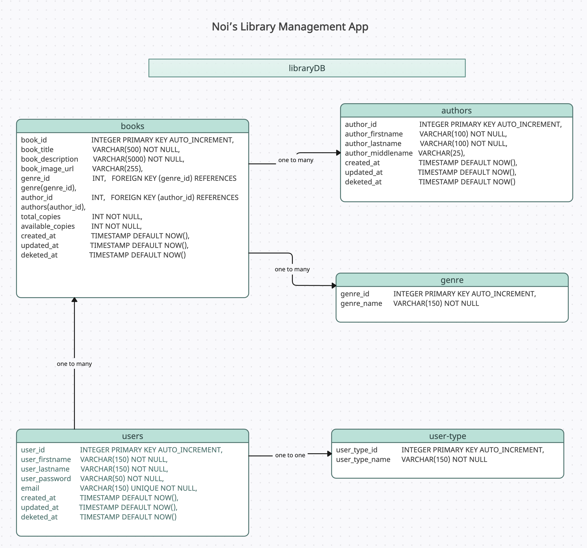
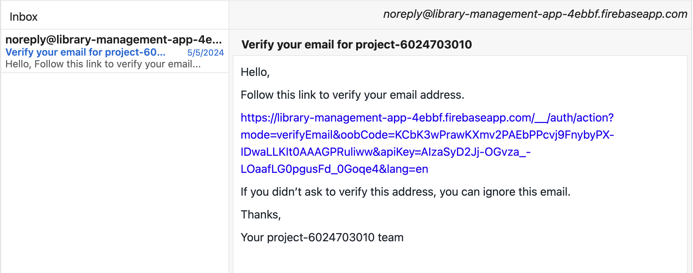
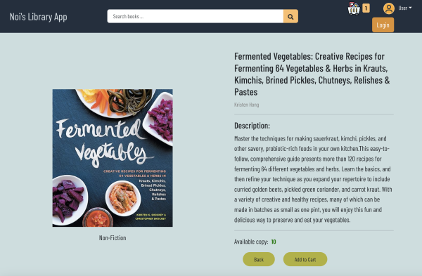
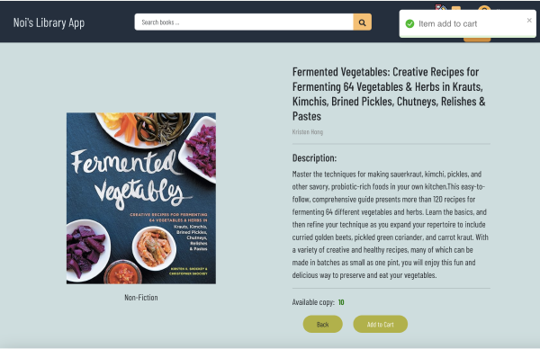

# Getting Started with Library Management System

Welcome to the Library Management System repository! This README will guide you through setting up the project and understanding its structure.

## Clone the Repository

To get started, clone the main repository to your local computer using the following command:
`git clone <repo code>`

## Setup Project

This repository contains three main applications:

### lb-backend

**Installation**

1. Navigate to lb-backend directory.
2. Install backend dependencies:
   `npm install`

**Running the Server**
To run the backend server, use the following command:
`npm run server`
The application will run on port 3307.

## lb-frontend

**Installation**

1. Navigate to lb-frontend directory.
2. Install backend dependencies:
   `npm install`

**Running the Application**
To run the frontend application, execute the following command.
`npm start`
The application will run on port 3000.

## lb-db

This directory contains a MySQL dump file named `mysql_dump.sql`.

**Database Setup**
To recreate the database on your local environment, follow these steps:

1. Open the command line interface.
2. Run the following command:
   `sudo mysql -u root -p library_db < library_db`

## Tech Stacks

#### Backend

- Node.js and Express.js: to create books endpoints, authors endpoints, and genre endpoint
- bcrypt.js: to has password
- jsonwebtoken: to secure transmitting of the information between frontend and backend

#### Frontend

- React: Build user interface.
- Redux-Toolkit - RTK query: State management.
- Bootstrap, SCSS, and Flexbox
- React Testing Library

#### Authentication

- Firebase
- Users can register and sign in using either their username and password or their Google account

#### Database

- MySQL

### Register / Login page

- allow user to log-in and register with Google account
- allow user to register with email and password
- email varification link will be sent to user to confirm

### Home Page

- Show all books in the collection
- User will be able to use search feature to find books by keyword

### Single book page

- View Book Details: Get an overview of the selected book, including its title, author, and genre

### Single book page when clicked on Add to Cart button

- Add to Cart Button: wil add the book to your shopping cart
- Confirmation Message: Upon clicking the "Add to Cart" button, a popup will appear confirming that the book has been successfully added to your cart
- Back Button: Easily navigate back to the home page by clicking the "Back" button. Continue browsing
- Cart Button: Click on the "Cart" button in the navigation bar to view your current cart contents and proceed to checkout

### Checkout page

The Cart page:

- Book List: View the books you've added to your cart, including their titles, authors, and genre
- Book Details: Click on the book image or title to return to the selected book's description page for further details
- Delete Button: Remove a book from your cart by clicking on the trash-can button next to it
- user will be able to finish checking out book by clicking at the Check out button
- Check Out Button: Click on the "Check Out" button to checkout

