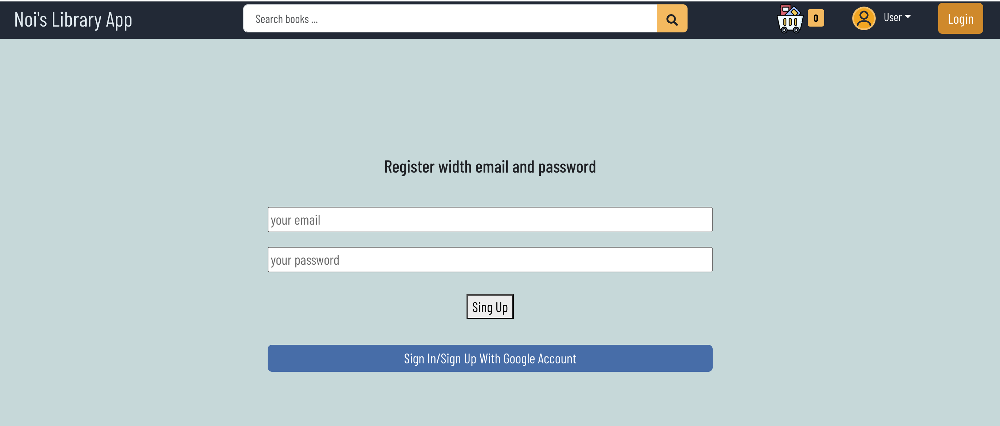
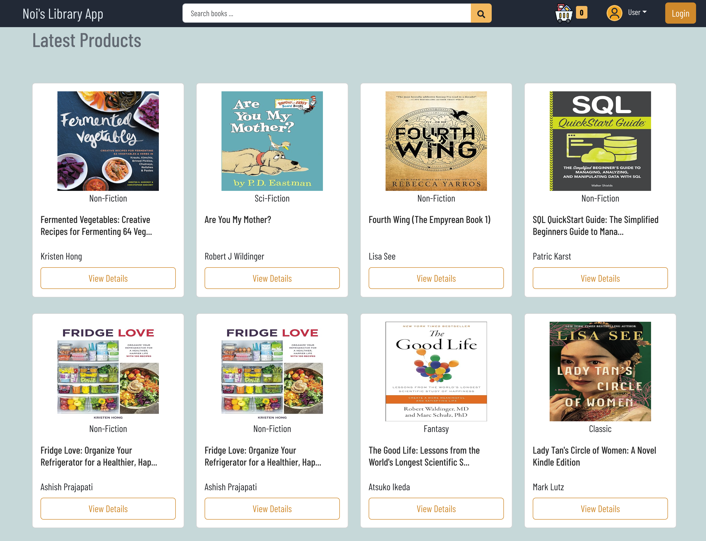
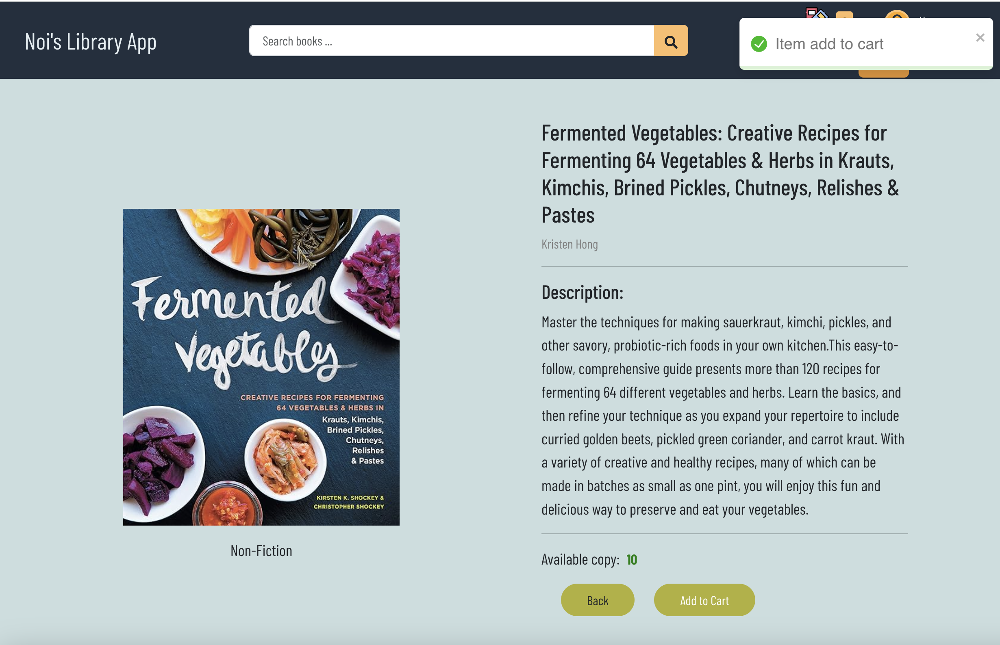
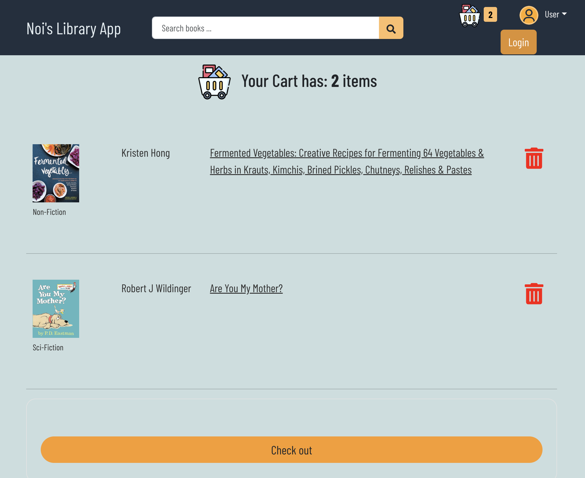

# Getting Started with Library Management System

Welcome to the Library Management System repository! This README will guide you through setting up the project and understanding its structure.

## Clone the Repository

To get started, clone the main repository to your local computer using the following command:
`git clone <repo code>`

## Setup Project

This repository contains three main applications:

### lb-backend

**Installation**

1. Navigate to lb-backend directory.
2. Install backend dependencies:
   `npm install`

**Running the Server**
To run the backend server, use the following command:
`npm run server`
The application will run on port 3307.

## lb-frontend

**Installation**

1. Navigate to lb-frontend directory.
2. Install backend dependencies:
   `npm install`

**Running the Application**
To run the frontend application, execute the following command.
`npm start`
The application will run on port 3000.

## lb-db

This directory contains a MySQL dump file named `mysql_dump.sql`.

**Database Setup**
To recreate the database on your local environment, follow these steps:

1. Open the command line interface.
2. Run the following command:
   `sudo mysql -u root -p library_db < library_db`

## Tech Stacks

#### Backend

- Node.js and Express.js: to create books endpoints, authors endpoints, and genre endpoint
- bcrypt.js: to has password
- jsonwebtoken: to secure transmitting of the information between frontend and backend

#### Frontend

- React: Build user interface.
- Redux-Toolkit - RTK query: State management.
- Bootstrap, SCSS, and Flexbox
- React Testing Library

#### Database

- MySQL

#### Authentication

- Firebase
- Users can register and sign in using either their username and password or their Google account.

### Register / Login page

### Home Page

### Single book page

### Single book page

### Single book page

